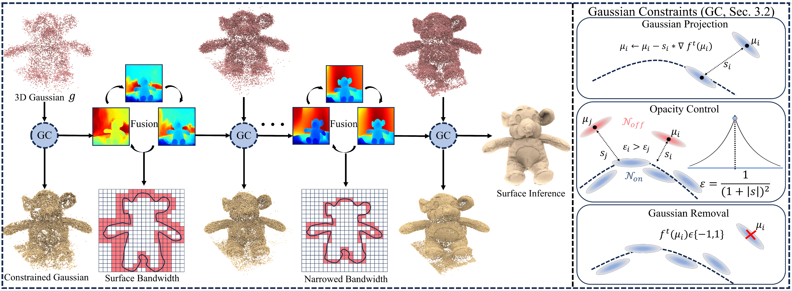

<p align="center" />
<h1 align="center">3D Gaussian Splatting with Self-Constrained Priors for High Fidelity Surface Reconstruction </h1>

<p align="center">
    <a href="https://github.com/takeshie/"><strong>Takeshi Noda</strong></a>
    ·
    <a href="https://yushen-liu.github.io/"><strong>Yu-Shen Liu</strong></a>
    ·
    <a href="https://h312h.github.io/"><strong>Zhizhong Han</strong></a>
</p>
<h2 align="center">CVPR 2026</h2>
<h3 align="center"><a href="https://arxiv.org/pdf/2603.19682">Paper</a> | <a href="https://takeshie.github.io/GSPrior/">Project Page</a></h3>
<div align="center"></div>
<p align="center">
    
</p>

<div class="content has-text-justified">
  <p style="margin-top: 30px">
    Overview of our method. Given 3D Gaussians
    <span class="math-inline">𝑔</span>, we employ a distance field specified by a fused TSDF grid as our prior
    <span class="math-inline">𝑓ᵗ</span>. With
    <span class="math-inline">𝑓ᵗ</span>, we define a bandwidth around the surface and iteratively refine
    <span class="math-inline">𝑓ᵗ</span> with updated depth renderings. We also apply Gaussian geometric constraints
    <span class="math-inline">(GC)</span> that are related to the interpolated distance
    <span class="math-inline">𝑠</span>, Gaussian centers
    <span class="math-inline">μ</span>, and TSDF gradients
    <span class="math-inline">∇𝑓ᵗ</span> for high-fidelity surface reconstruction.
  </p>
</div>

## Installation
1. Clone GSPrior
```
git clone --recursive https://github.com/Hong753/GSPrior.git
```
2. Setup Anaconda Environment
```
conda create -n gsprior python=3.12 -y
conda activate gsprior

# Optional
conda install spyder -y

pip install torch==2.7.0 torchvision==0.22.0 --index-url https://download.pytorch.org/whl/cu128
#pip install -r requirements.txt
pip install --no-build-isolation git+https://github.com/camenduru/simple-knn
pip install --no-build-isolation submodules/diff-plane-rasterization
```

## Dataset
- Download the NeRF-Synthetic dataset from (https://drive.google.com/drive/folders/1cK3UDIJqKAAm7zyrxRYVFJ0BRMgrwhh4)
- Download the DTU dataset datasets from (https://roboimagedata.compute.dtu.dk/?page_id=36)
- Download the TNT dataset datasets from (https://www.tanksandtemples.org/download/)
- Download the MIP-NeRF 360 datasets from (https://jonbarron.info/mipnerf360/)

## Training and Evaluation

### Fast Start
We provide a simple example for training and evaluation on the DTU dataset.
```bash
python train.py -s <path_to_scene> -m <path_to_output>
```
After training, use `render.py` for rendering and evaluation:
```bash
python render.py -s <dataset_path>/<scene_name> -m <output_path>/<scene_name>
```

For training and evaluating multiple scenes, we follow the evaluation protocol of [PGSR](https://github.com/zju3dv/PGSR) and provide the corresponding scripts in the `scripts` directory.

```bash
bash scripts/<script_name>.sh
```

Please modify the dataset paths, output paths, scene IDs, and GPU settings in the scripts according to your local environment. After training and evaluation, the final results include the visualization results of the TSDF and TSDF prior. We provide reference outputs in the `out` directory. The generated results may include rendered images, evaluation outputs, TSDF visualization results, and TSDF-prior visualization results.
## Citation
If you find our code or paper useful, please consider citing
```bibtex
@article{noda20263d,
  title={3D Gaussian Splatting with Self-Constrained Priors for High Fidelity Surface Reconstruction},
  author={Noda, Takeshi and Liu, Yu-Shen and Han, Zhizhong},
  journal={arXiv preprint arXiv:2603.19682},
  year={2026}
}
```

## Acknowledgement
This project is built upon [PGSR](https://github.com/zju3dv/PGSR) and [GS-Pull](https://github.com/wen-yuan-zhang/GS-Pull). Thanks for these great projects.
